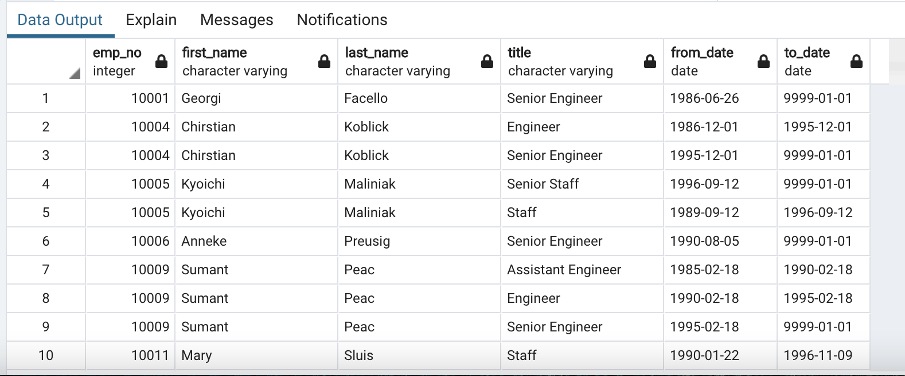
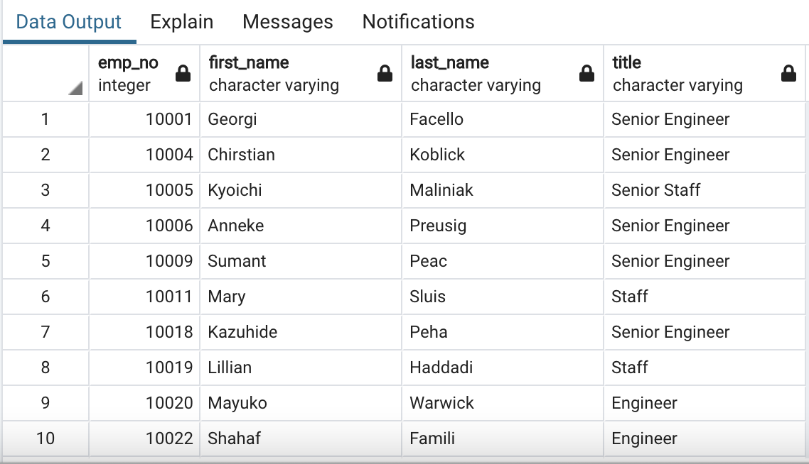
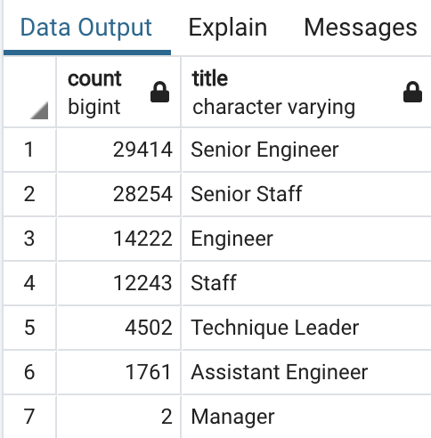
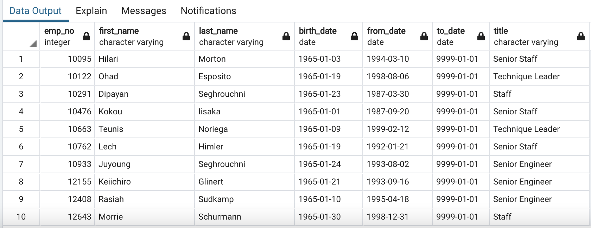

# Pewlett Hackard Analysis
## Overview
Pewlett Hackard is preparing for a "silver tsunami"- a large wave of their employees are reaching retirement age. The purpose of this analysis was to use SQL to find the employees who are likely to retire soon and their job titles. The analysis also found which of them may be eligible for a mentorship program to help prepare and train the new employees in the next generation of Pewlett Hackard.  
SQL Schema:     
SQL Queries:   
## Results
### Major Point 1: Retirement Titles Table
The first major finding from this analysis is the table of information for the titles of those employees who are reaching retirement age. An issue with this table is that some employees have had multiple titles throught their career with Pewlett Hackard. Because of this, an additional table was necessary to show the most recent job title. However, this table still has useful information and is shown below.  
Complete csv file:    
Query output image:    

### Major Point 2: Unique Titles Table  
Because of the issue of multiple titles per employee in the previous table, the next significant finding shows each employee's most recent title. This will be helpful as it shows who is leaving each role. The table is shown below.  
Complete csv file:   
Query output image:    

### Major Point 3  
The third major finding from this analysis is the number of employees who are leaving each job title. This is important for planning how many employees will need to be hired to fill these roles. Of note, the job title with the most openings is Senior Engineer. The table is pictured below.  
Complete csv file:    
Query output image:   

### Major Point 4  
Another major finding from this analysis is a list of the employees nearing retirement who are eligible for a mentorship program to help train new employees. This table is shown below.  
Complete csv file: 
Query output image:      

## Summary and Additional Questions 
1. How many roles will need to be filled as the silver tsunami makes an impact?  
The number of roles that will need to be filled as the silver tsunami makes an impact can be found using the table of retiring titles. This table shows the nubmer of employees of retiring age for each job title. The overal number of roles that need to be filled can be found using the query:  
SELECT COUNT(emp_no)  
FROM unique_titles;  
The result is 90,399.  
2. Are there enough qualified, retirement-ready employees in the department to mentor the next generation of Pewlett-Hackard employees?  
To answer this question, a query can be run on the mentorship eligible table to count the number of employees who qualify. Then, this number can be compared to the number of employees who are retiring. The following query can be used to determine the number of mentorship-eligible employees by job title:  
SELECT COUNT(title)  
INTO mentorship_count  
FROM mentorship_eligible  
GROUP BY title  
ORDER BY count DESC;  
